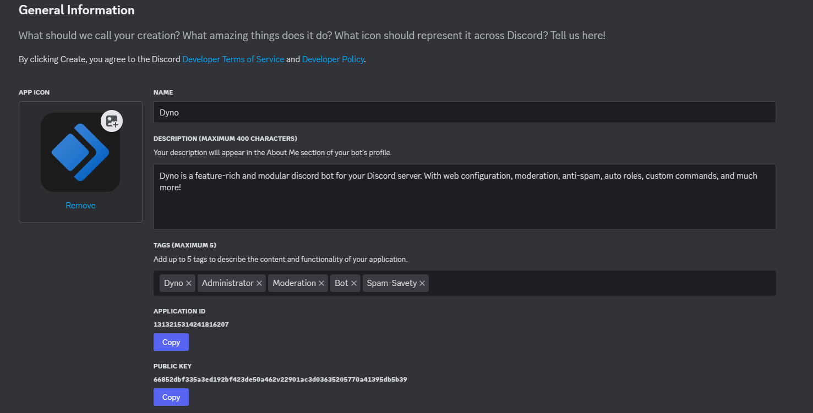
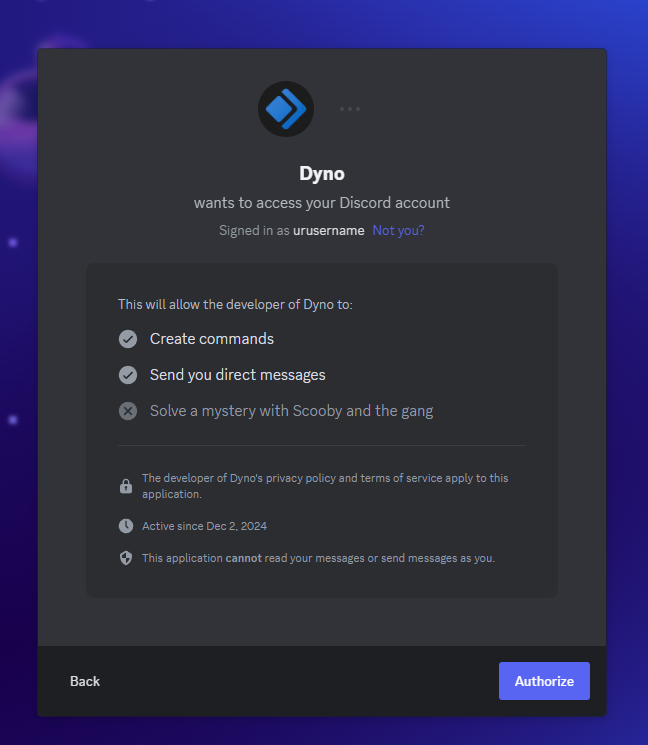

# Discord-Application-Raider
##### All credits to TheEinzzCookie

### A discord raider to spam channels using a Discord Application.
#### Create the application on an alt account. Do NOT use your main account!

<br>

## *Disclaimer:*
```This is for educational purposes only. Use this only if you have the consent of the server owner. I am not responsible for any damage done by this bot.```

<br>

## Setup
- Make sure you have [Python](https://www.python.org/)
- Create a new app on the [Developer Portal](https://discord.com/developers/applications), optional name the Bot sth. like "Dyno" and give it the correct profile picture and description
- Example:


- You can already see the Token-Part, save it somewhere since it's needed later





- Download repo as a zip-file and save it somewhere
- Unpack the .zip file
- Open Cmd and direct yourself into the unpacked folder containing the files

### Installation
- Install dependecies with `pip install -r requirements.txt` or `pip3 install -r requirements.txt`
- Run the bot using `python raider.py` or `python3 raider.py`

## Use the bot
- Allow the created app access to your Discord Account (Shown in Setup)
- Follow the instructions in the console window
- Use /spamraid command in the channel to raid or use the external app window


## Results


## License
###  
